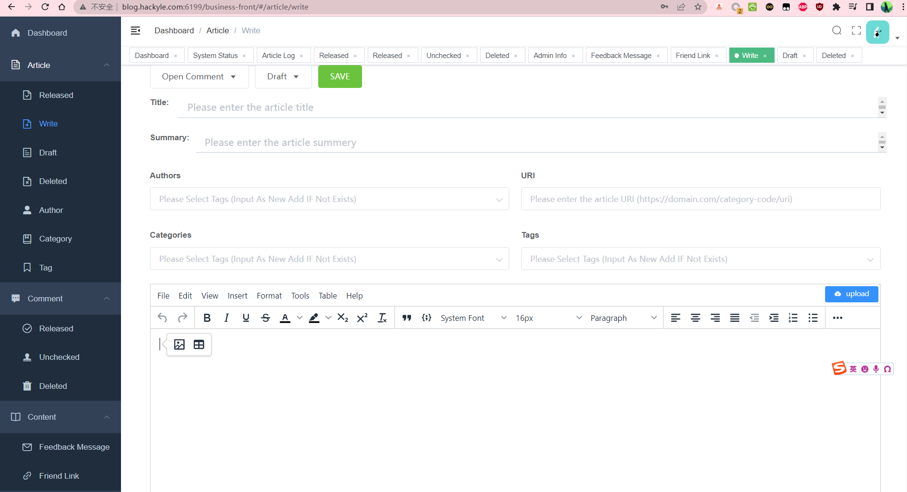
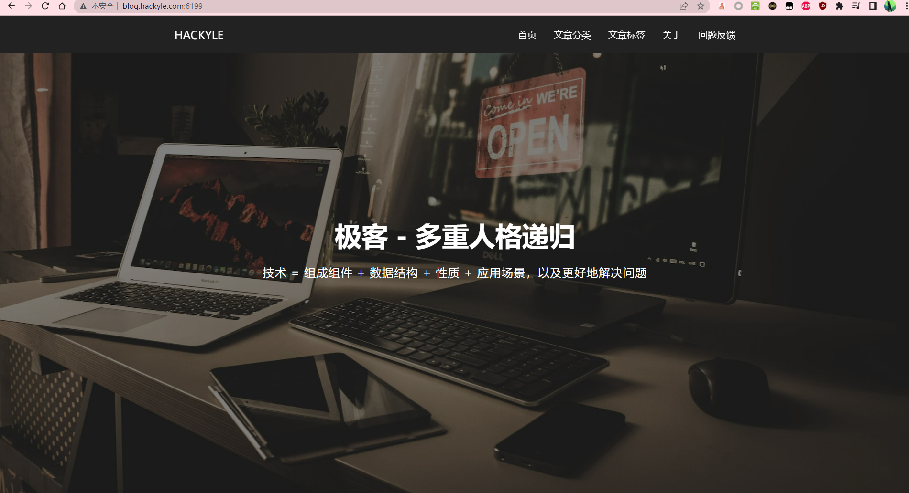
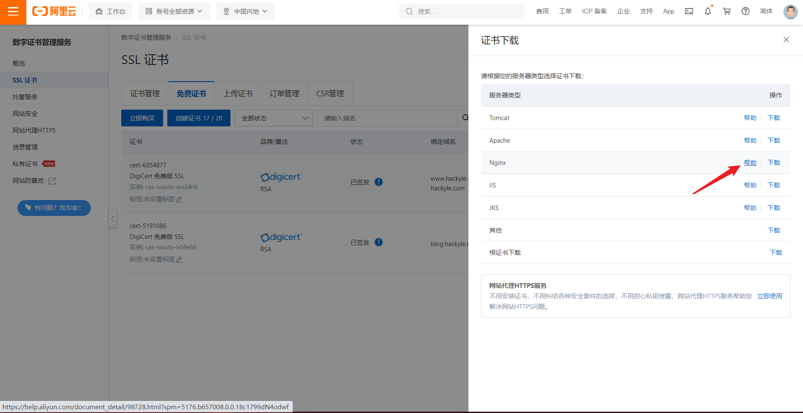

**一款简单且纯粹的博客系统**  | **A Simple and Pure Blog System**


**B端、C端的概念**

- C端：Consumer（也可理解为Customer），通常为消费者、个人终端用户使用的客户端。如：淘宝主页、网易云主页。在博客系统中，C端主要为客户提供文章展示。

- B端：Business，通常为企业内部或商家使用的系统或平台。如：企业内部ERP管理系统、财务管理平台等。在博客系统，B端主要为作者提供文章的管理（写文章、修改文章等）。


**项目聚合：Blog**

- blog-business：后台管理端的SpringBoot后端项目，单独打成Jar包运行
- blog-business-web：后台管理的Vue2前端项目
- blog-consumer：前台客户端的SpringBoot+Thymeleaf项目，前后端不分离（在服务器上渲染成HTML发给浏览器解析，这么做的主要目的是便于SEO），单独打成Jar运行
- blog-common：通用的代码模块，例如配置类、util


# 快速预览

> 后台管理端-写文章页面的示例



> 前台展示端：首页



# 功能特性

**当前最新版本：1.0.0-RELEASE**

**文章管理（Article）**

- 文章管理：查询文章列表、新增文章、编辑文章、删除文章
- 文章分类管理：查询分类列表、新增分类、编辑分类、删除分类
- 文章标签管理
- 文章作者管理

 **评论管理（Comment）**

- 客户端添加评论（增加操作）
- 管理端对评论进行管理（删除、是否发布等操作）

**内容管理（Content）**

- 友链管理：查询友链列表、新增友链、编辑友链、删除友链

- 客户留言板、问题反馈

**配置中心（Configuration Center）**

- Admin info

**系统管理（System Manage）**

- 服务器状态

- 日志信息


# 技术栈

**后台端**

- 前端：Vue2生态（基于PanJiaChen大佬的开源项目：https://github.com/PanJiaChen/vue-admin-template/）
- 后端：SpringBoot生态

**前台端**

- 前后端不分离，使用Thymeleaf在后端将页面渲染后，发给浏览器解析。不分离的主要目的是便于SEO！
- SpringBoot + Thymeleaf


# 本地运行

**step1：环境准备&检查**

- Java：11
- SpringBoot：2.7.18
- Apache Maven：3.6.3
- Vue：2.6.11
- Node：16.14.2
- npm：8.5.0

**Step2：启动MySQL、Redis**

**step3：下载本仓库到本地**

**B端**

1. 执行初始化SQL：sql/blog_hackyle_com_dev.sql
3. 运行启动类：blog-business#BlogBusinessApp.java
4. 进入到blog-business-web目录，打开一个终端，安装依赖：npm install
5. 运行项目：npm run serve

**C端**

1. 进入到blog-consumer目录
2. 运行启动类：BlogConsumerApp.java

**Optional Step4：配置静态资源的存取**（如果不需要上传图片等静态资源可不配置）

1. 进入配置文件：application-dev.yml，配置file-storage-path和file-domain
2. 下载Nginx，编辑配置文件：conf/nginx.conf，然后启动

```
worker_processes  1;

events {
    worker_connections  1024;
}

http {
    include       mime.types;
    default_type  application/octet-stream;

    sendfile        on;
    keepalive_timeout  65;

    server {
        listen       80;
        server_name  localhost;

        location / {
            # 这里需要和application-dev.yml中的file-storage-path一样
            alias D:\\A03-Program\\A-Programming\\GitHub\\Blog\\res.hackyle.com\\;
        }
        
        error_page   500 502 503 504  /50x.html;
        location = /50x.html {
            root   html;
        }
    }
}
```


# 设计与实现概述

- 所有的请求全部打在Nginx上，使用Nginx进行分流到不同的本地服务上
- 正式环境使用HTTPs保证数据传输的安全性（测试环境为了方便不使用HTTPs）


**测试环境的服务运行端口约定**

- B端：后台=6101，前台=6106

- C端：60=6111


## 云服务器

**Step1：购买云服务器** 基于以下服务所占用的内存，我购买的是2核2GB突发型实例（CentOS7.8-x64）

minio：150MB

MySQL：450MB

business-boot：400MB

consumer-boot：300MB

Redis：100MB

**Step2：注册域名**

**Step3：环境安装** 。主要有JDK11、MySQL、Nginx、Redis、Minio

**Step4：项目部署**

1. 前台项目部署：blog-consumer.jar
   1. **nohup java -jar blog-consumer-test.jar --spring.profiles.active=test >/dev/null 2>&1 &**
   2. 运行于端口：6111
2. 后台后端项目部署：blog-business.jar
   1. **nohup java -jar blog-business-boot-test.jar --spring.profiles.active=test >/dev/null 2>&1 &**
   2. 运行于端口：6101
3. 后台前端项目部署：由于是Vue项目，直接使用npm打包为静态资源，上传到某个位置，直接交给Nginx解析

## 配置HTTPS概述

**Tutorial Reference：** https://www.cnblogs.com/eternalness/p/8321827.html



**主要步骤**

1. 下载SSL证书，解压

2. 在/etc/nginx/下新建cert目录，上传解压后的文件

3. 根据服务器类型，点击进入上图中的帮助，按照步骤部署即可


## 静态资源存储

**存储所有的静态资源文件：** 

- 图片
- 视频（由于网站的带宽比较小，不直接存放视频文件，存放于第三方站点上）
- 音乐
- Word、PDF等文档
- 其他资源文件


**主要步骤**

1. 在云服务器上，配置一个目录，专门存放静态资源（一般是图片），例如：/data/res.hackyle.com/
2. 博客中的上传操作，经过文件流写到该个目录下
3. 对外还是以https://res.hackyle.com的方式提供访问，通过nginx，解析到该个文件夹


 **确定静态资源的存储目录：**/data/res.hackyle.com/

- 存储示例：/data/res.hackyle.com/业务名/年份/月份/文件名.拓展名
- 例如博客（https://blog.hackyle.com），业务名为“blog” 

 

**设定静态资源通过以下域访问：https://res.hackyle.com**

1. 为域（res.hackyle.com）申请DigiCert 免费版 SSL，下载key和pem文件

2. 上传到服务器的指定位置，为了方便管理，全部上传至/etc/nginx/cert/

3. 配置Nginx

```
# 静态资源服务：res.conf
server {
    listen 80;
    server_name res.hackyle.com;
    
    #地址重写到https
    rewrite ^(.*)$ https://$host$1;
}
server {
    listen 443 ssl http2;
    listen [::]:443 ssl http2;
    server_name res.hackyle.com;
    
    ssl_certificate "/etc/nginx/cert/res.hackyle.com.pem";
    ssl_certificate_key "/etc/nginx/cert/res.hackyle.com.key";
    ssl_session_cache shared:SSL:1m;
    ssl_session_timeout  10m;
    ssl_ciphers HIGH:!aNULL:!MD5;
    ssl_prefer_server_ciphers on;
    
    #==存在问题：凡是不是从主页跳转到文章页面，都会被拦截
    #防盗链：验证所有请求中的Referer是否来自*.hackyle.com，否则响应403
    #valid_referers blocked *.hackyle.com;
    #   if ($invalid_referer){
    #    return 403;
    #}
    
    # https://res.hackyle.com/业务名/年份/月份/uuid.文件拓展名
    location / {
        alias /data/res.hackyle.com/;
    }
}
```


**移除Minio**

- minio是分布式的文件存储系统，文件会被分割为多个块，分布式存储于多个节点上，这对于简单系统的静态资源管理十分繁杂、冗余

- minio存储在单机节点上时，会产生多个文件夹，不方便备份、数据恢复

## Nginx Conf

```
# Blog-Test
server {
  listen 6199;
  server_name blog.hackyle.com;
             
  #C端的测试环境
  location / {
      proxy_pass http://localhost:6111/;
  }
  #B端的测试环境：前台
  location /business-front {
      alias /data/blog.hackyle.com/business-web-test/;
      index index.html;
  }
  #B端的测试环境：后台
  location /business-back {
      alias /;
      proxy_pass http://localhost:6101/;
  }
  location /demo {
      default_type text/plain;
      return 200 "this is blog.hackyle.com test";
  }
  
  error_page 404 /404.html;
      location = /40xds.html {
  }

  error_page 500 502 503 504 /50x.html;
      location = /50x.html {
  }
}
```


## 流程

- 客户端（http://blog.hackyle.com:6199/） 的请求进入云服务器时，打到Nginx，通过反向代理到本地运行的blog-consumer服务：http://localhost:6111

- 管理端（http://blog.hackyle.com:6199/business-front/） 的请求进入云服务器时，映射到/data/blog.hackyle.com/business-vue2-test/，其为前台Vue项目打包后的静态资源
- 管理端前端对后端的请求（http://blog.hackyle.com:6199/business-back）， 经过Nginx解析到blog-business-boot服务上：http://localhost:6101/

# QA

**现阶段写博客的平台或解决方案：** https://juejin.cn/post/6844904146391433229

**博客集成化框架：** https://www.10besty.com/best-free-blogging-platforms/


